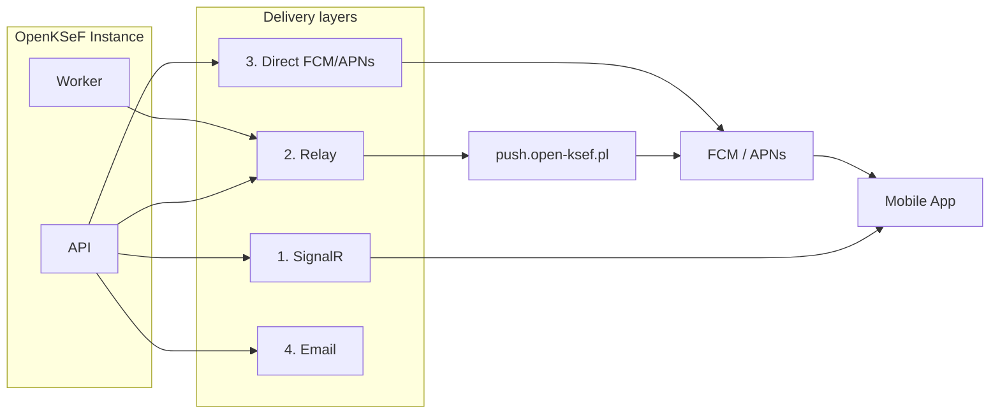

# Push Notifications

## Architecture



Providers are tried in order. Most self-hosted installs use **SignalR + Relay** only (no Firebase needed).

## Configuration

Set in the admin wizard (Step 5 -- Integrations) or in Settings > Integrations:

| Mode | What to do |
|------|-----------|
| **Relay** (default) | URL `https://push.open-ksef.pl` pre-filled. Optional API key. |
| **Own Firebase** | Paste service account JSON from Firebase Console. |
| **Local only** | SignalR only, no remote push. |

Config is stored in `SystemConfig` table: `push_relay_url`, `push_relay_api_key`, `firebase_credentials_json`.

## Device tokens

Devices register via `POST /api/devices/register`. Tokens starting with `device-` are SignalR-only placeholders (no `google-services.json` in the mobile build). Real FCM/APNs tokens enable remote push.

## PushRelay deployment

Separate Docker image, deployed independently from the main stack. See [`docker-compose.push-relay.yml`](../docker-compose.push-relay.yml).

```bash
# Dev
docker compose -f docker-compose.push-relay.yml up -d --build

# Prod
PUSH_RELAY_IMAGE=ghcr.io/open-ksef/openksef-push-relay:latest \
  docker compose -f docker-compose.push-relay.yml up -d
```

Recommended: put Cloudflare in front (`push.open-ksef.pl`) for HTTPS + rate limiting (`/api/push`, 100 req/min).

| Variable | Description |
|----------|-------------|
| `Relay__ApiKey` | HMAC shared key |
| `Firebase__CredentialsJson` | Firebase service account JSON |
| `APNs__BundleId` | iOS bundle ID (default: `com.openksef.mobile`) |
| `APNs__KeyId` / `APNs__TeamId` / `APNs__AuthKeyP8` | APNs p8 auth |

Health check: `GET /health`

## Testing

1. Portal > **Devices** > find device > **Test**
2. Check relay: `curl https://push.open-ksef.pl/health`

## Troubleshooting

| Symptom | Fix |
|---------|-----|
| No notifications from background sync | Worker push providers missing -- update to latest version |
| SignalR not connecting through gateway | Verify nginx routes `/hubs/` to API |
| Relay 401 | API key mismatch |
| Relay 502 | Firebase/APNs credentials invalid on relay |
